## 第一部分 设计概述 

### 1.1 设计目的

​	作品基于赛方提供的`PYNQ-Z2`开发板,采用软硬件协同方案,搭建基于`DMA`的图像数据缓存传输系统。在此基础上,自主设计基于`AXI4-stream`接口的图像处理IP核,从而构建高实时性的运动目标检测系统。

​	在我们的设计中，侧重PL部分数字逻辑开发，对传统的帧差法进行改进，通过对缓存背景帧的累加压缩和重建展开达到节省逻辑资源的优化目标。


### 1.2 应用领域

​	本系统消耗较小资源，可以应用在如自动触发门禁、设备智能检测、远程婴幼儿监护、家庭防盗等场景，有效降低成本，也可以使得有限逻辑资源的PL部分留有余地去做其他处理。


### 1.3 主要技术特点

​	检测方法上采用了帧间差分法,其具有运算简单,资源消耗少,易于实时检测的特点。

​	在整个设计中,需要缓存前一帧作为背景帧以便与后一帧相减得到绝对值。本设计结合FPGA自身的并行流水特性,对传统的帧间差分法进行改进,将前一帧从`640×480×8bit`的灰度图像通过2×2的窗口累加压缩为`320×240×10bit`的灰度图像作为缓存帧,在帧差过程中再重建展开用于运算，节省缓存帧图像使用的BRAM。帧差得到的运动区域,与完整的现帧图像结合获得红色运动区域，并通过蓝色矩形包围盒捕捉。

​	而依照此方法类推,可以使用4×4乃至更大的矩阵累加压缩,在少量降低精度不对检测产生较大影响的同时,可以大大减少缓存图像的`BRAM`,从而使得PL部分可以腾出逻辑资源用于其他处理。

 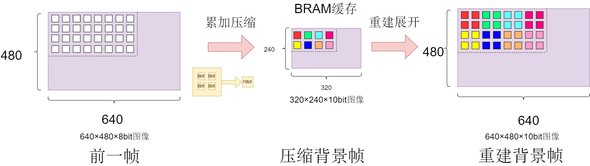

### 1.4 关键性能指标

​	Utilization（型号：xc7z020clg400-1）：

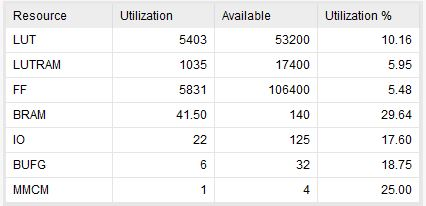


​	电路连接图（外接摄像头和HDMI）：


​	效果图（红色是运动轨迹，蓝色是矩形包围盒）：


## 第二部分 系统组成及功能说明 

### 2.1 整体介绍

#### 2.1.1 系统架构

​	采集OV7725摄像头数据,通过 `Video In AXI4-Stream`转换为stream数据流。

​	随后经过基于`AXI4-stream`接口的图像处理IP核,其流水线处理实现了灰度化、中值滤波、累加压缩、缓存背景帧、帧差、阈值化、重建展开、包围盒捕捉以及重叠输出到DMA写通道,DMA写通道将图像数据搬运缓存到DDR，通过中断实现三缓存机制。

​	于此同时,DMA读通道始终读取三缓存中写通道正在写的帧的前一帧,再通过`AXI4-Stream to Video Out`转换为行场视频信号输出到HDMI驱动IP,最后在外接显示器上呈现图像处理效果。


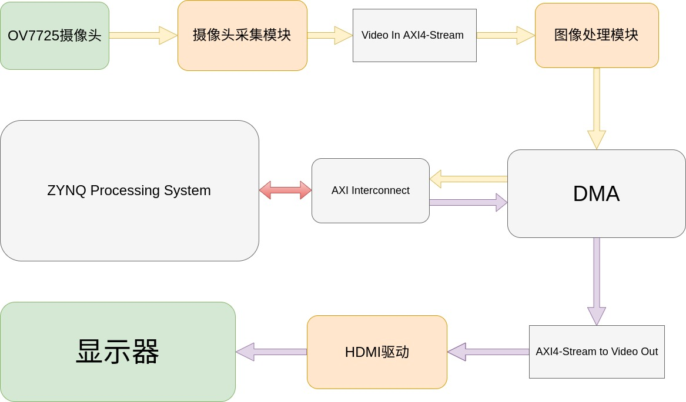


#### 2.1.2 Vivado Block Design

​	下图是vivado的block design。

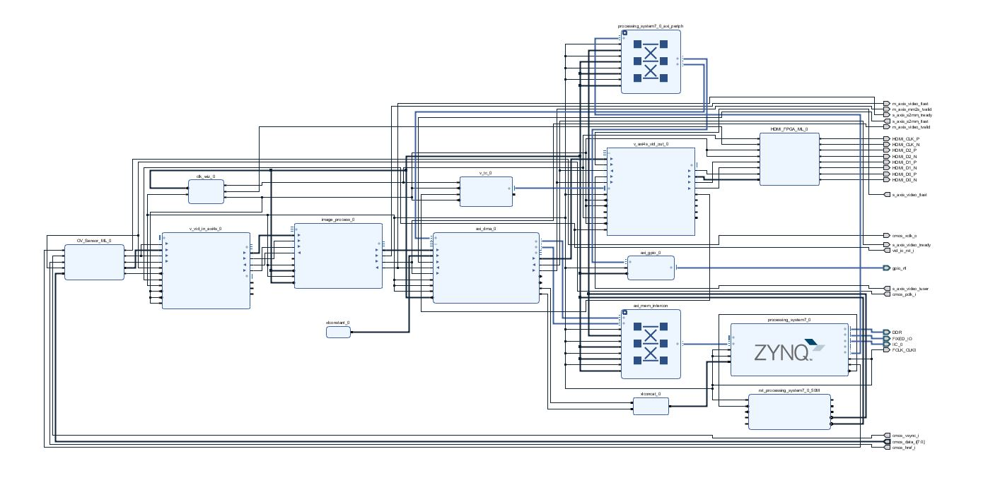


### 2.2 各模块介绍


#### 2.2.1 图像处理IP核

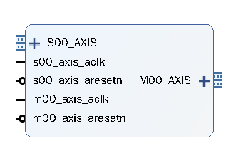

##### 2.2.1.1 图像处理简述

​	基于`AXI4-stream`接口的图像处理IP核,其流水线处理实现了灰度化、中值滤波、累加压缩、缓存背景帧、帧差、阈值化、重建展开、包围盒捕捉以及重叠输出，流水化作业通过模块输入数据握手信号作为ce使能控制，输出端由一个小型同步fifo缓冲。

 

##### 2.2.1.2 IP核内部架构

 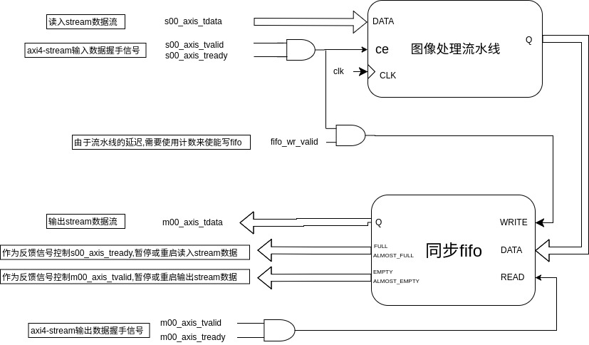

 

​	由于输入数据是不连续的,对流水线使用ce使能控制。

​	使用一个很小的同步fifo(位宽为24,深度为32)来缓冲流水线输出数据,另外利用fifo的满空信号对stream接口握手信号控制。

 

##### 2.2.1.3 详细过程


​	下面介绍图像处理的详细过程以及代码。


**(1)AXI4-Stream接口**

​	在2.2.1.2中阐释了接口的设计，下面是读写握手信号部分代码。

```verilog
assign rnext = s00_axis_tready && s00_axis_tvalid;
assign wnext = m00_axis_tvalid && m00_axis_tready;

always @(posedge m00_axis_aclk)
begin
	if(!m00_axis_aresetn)
		m00_axis_tvalid<=1'b0;
	else if(signal_empty)
		m00_axis_tvalid<=1'b0;
	else if( signal_almost_empty && wnext )
		m00_axis_tvalid<=1'b0;
	else if( (!signal_empty) && (!m00_axis_tvalid) && m00_axis_tready )
		m00_axis_tvalid<=1'b1;
	else 
		m00_axis_tvalid<=1'b1;
end

always @(posedge m00_axis_aclk)
begin
	if(!m00_axis_aresetn)
		s00_axis_tready<=1'b0;
	else if(signal_full)
		s00_axis_tready<=1'b0;
	else if( signal_almost_full && rnext )
		s00_axis_tready<=1'b0;
	else if( (!signal_full) && (!s00_axis_tready) && s00_axis_tvalid )
		s00_axis_tready<=1'b1;
	else 
		s00_axis_tready<=1'b1;
end
```


**(2) 灰度化**

​	为了便于之后的图像处理,我们首先把RGB888格式的数据转换为灰度值。

​	通常,通过以下公式转换:

​                                              `Gray=0.299*Red+0.587*Green+0.114*Blue`

​	式子中 **Red**、**Green**、**Blue**分别为每个像素点红色、绿色、蓝色的量化值。**Gray**为转换后得到的灰度值.

​	再利用二进制移位性质,将浮点运算近似化简为定点运算,然后分割为两级流水,化简公式如下：

​                                            `(Gray<<8)=[(Red<<6)+(Red<<3)+(Red<<2)+Red]`

​                                                               `+[(Green<<7)+(Green<<4)+(Green<<2)+Green]`

​                                                               `+[(Blue<<4)+(Blue<<3)+(Blue<<2)+1]`

 

​	下面是灰度转换部分代码：

```verilog
assign red = rgb[23:16];
assign green = rgb[15:8];
assign blue = rgb[7:0];

assign gray_w = gray_r + gray_g + gray_b;

always@(posedge clk)
begin
    if(!rst)
		begin
			gray_r <= 0;
			gray_g <= 0;
			gray_b <= 0;
		end
    else if(ce)
		begin
			gray_r <= (red <<6) + (red <<3) + (red <<2) + red;
			gray_g <= (green<<7) + (green<<4) + (green<<2) + green;
			gray_b <= (blue <<4) + (blue <<3) + (blue <<2) + 1;
		end
	
	else
		begin
			gray_r <= gray_r;
			gray_g <= gray_g;
			gray_b <= gray_b;
		end
end

always@(posedge clk)
begin
    if(!rst)
        gray <= 0;
    else if(ce)
		gray <= gray_w[15:8];
	else
		gray <= gray;
end
```


**(3) 中值滤波**

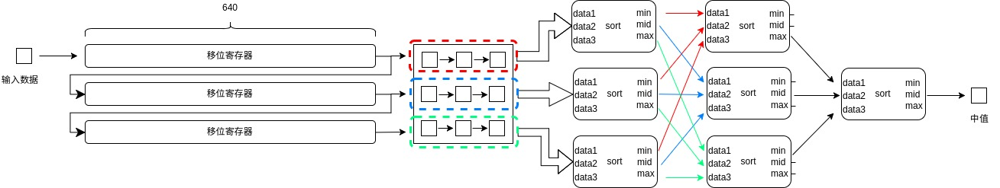

 	为了保证图像质量,我们使用中值滤波来去除椒盐噪声,也就是求得 3*3 像素阵列的中间值.通过上图所示,我们用三级流水实现。

​	第一级:将3*3像素阵列划分为三份,每3个元素排序,得到相应的最大值、中间值、最小值。

​	第二级:将第一级得到的三个最大值排序得到其中的最小值,三个最小值排序得到其中的最大值,三个中间值排序得到其中的中间值。

​	第三级:将第二级得到的三个值排序得到中间值。

 

​	下面是三个数据排序部分代码：

```verilog
always@(posedge clk) 
begin  
	if(!rst)   
		begin   
			max_data <= 0;   
			mid_data <= 0;   
			min_data <= 0;   
		end  
	else if(ce)
		begin
			if(data1 >= data2 && data1 >= data3)    
				max_data <= data1;   
			else if(data2 >= data1 && data2 >= data3)    
				max_data <= data2;   
			else   
				max_data <= data3; 
 
			if((data1 >= data2 && data1 <= data3) || (data1 >= data3 && data1 <= data2))    
				mid_data <= data1;   
			else if((data2 >= data1 && data2 <= data3) || (data2 >= data3 && data2 <= data1))   
				mid_data <= data2;   
			else   
				mid_data <= data3;   
				
			if(data1 <= data2 && data1 <= data3)    
				min_data <= data1;   
			else if(data2 <= data1 && data2 <= data3)    
				min_data <= data2;   
			else    
				min_data <= data3;  
		end
	else	
		begin      
			max_data <= max_data;   
			mid_data <= mid_data;   
			min_data <= min_data;   		
		end 
end 
```


**(4)累加压缩**

 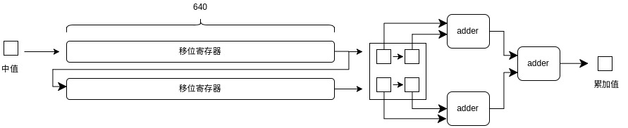

​	为了减小缓存帧大小，我们对原来的灰度图像累加压缩,如上图所示.通过两级流水累加,对2*2像素阵列压缩.

​	效果如下图所示:

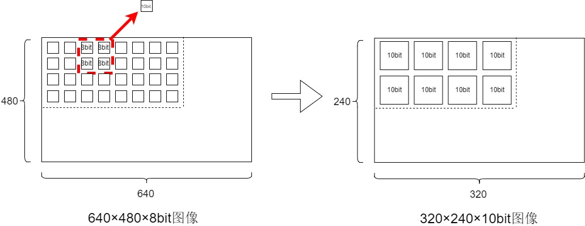

 	

​	下面是累加压缩部分代码：

```verilog
always @(posedge clk)
begin
	if(!rst)
		begin
			av_buffer1<=0;
			av_buffer2<=0;
			average_value<=0;
		end
	else if(ce)
		begin
			av_buffer1<=data11+data12;
			av_buffer2<=data21+data22;
			average_value<=av_buffer1+av_buffer2;
		end
	else
		begin
			av_buffer1<=av_buffer1;
			av_buffer2<=av_buffer2;
			average_value<=average_value;
		end
end 
```

​	但需要注意的一点是，在我们的设计中，输出数据被下一级模块采样时序是与在中值滤波时完全不同。因为在一个同样长度的周期中，中值滤波模块输入1280个数据，输出1280个数据，累加压缩模块则是输入1280个数据，输出320个数据。

​	下图是两者采样时序的比较：

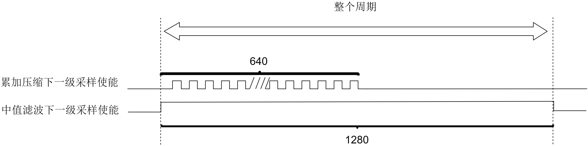

​	 在实际设计中，我们使用计数器来实现累加压缩下一级采样，计数器从0到1279循环计数，采样使能在未与流水线使能ce相与前为`(cnt[0]==0) && (cnt<640)`。


**(5)缓存背景帧**

​	这里使用vivado的`FIFO Generator`生成基于`block ram`的同步fifo，`write width`为10，`write depth`为131072，使用了36个bram。

​	下面是缓存背景帧的部分代码，需要注意的是，在第一帧存入fifo时，fifo读使能无效，只有从第二帧开始，读使能才可能有效。这时背景帧存入的数据始终保持在320×240×10bit，每写入一个数据，就读出一个数据用作后续处理。

```verilog

always @(posedge clk)
begin
    if(!rst)
        backframe_rd_valid<=0;
    else if( ce && (bf_cnt==76799) )
        backframe_rd_valid<=1;
    else
        backframe_rd_valid<=backframe_rd_valid;
end

fifo_backframe unit_fifo_backframe
(
.clk(clk),
.srst(!rst),
.din(average_value), 
.wr_en( (cnt[0]==0) && (cnt<640) && ce ),
.rd_en( (cnt[0]==0) && (cnt<640) && ce && backframe_rd_valid),
.dout(back_pixel),
.data_count()
);
```


**(6)重建展开**

​	当前帧与缓存帧都经过累加压缩后的数据流，我们将两者展开，这将为后续帧差以及运动区域附加在原本完整图像上打下基础。

​	如下图所示，将压缩后的图像进行展开，实质上是像素数据流操作。


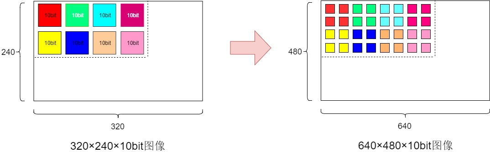

 

​	下面是进行上述操作的代码。

```verilog
assign rd = (cnt>=640) && ce;

always @(posedge clk)
begin
    if(!rst)
        wr<=0;
    else 
        wr<=(cnt<640) && ce;
end

always @(posedge clk)
begin
	if(!rst)
		cnt<=0;
	else if( ce && (cnt==1279) )
		cnt<=0;
	else if( ce && (cnt!=1279) )
		cnt<=cnt+1;
	else
	   cnt<=cnt;
end

fifo_block_av_gen unit_fifo_block_av_gen
(
.clk(clk),
.srst(!rst),
.din(value_generated),
.wr_en(wr),
.rd_en(rd),
.dout(fifo_gen),
.data_count()
);

fifo_block_av_gen unit_fifo_block_bf_gen
(
.clk(clk),
.srst(!rst),
.din(bf_generated),
.wr_en(wr),
.rd_en(rd),
.dout(fifo_gen_bf),
.data_count()
);

always @(posedge clk)
begin
	if(!rst)
		value_generated<=0;
	else if( (cnt[0]==0) && (cnt<640) && ce ) 
		value_generated<=average_value;
	else if( (cnt[0]==1) && (cnt<640) && ce )
		value_generated<=value_generated;
	else if( (cnt>=640) && ce )
		value_generated<=fifo_gen;	
	else
		value_generated<=value_generated;
end

always @(posedge clk)
begin
	if(!rst)
		bf_generated<=0;
	else if( (cnt[0]==0) && (cnt<640) && ce ) 
		bf_generated<=back_pixel;
	else if( (cnt[0]==1) && (cnt<640) && ce )
		bf_generated<=bf_generated;
	else if( (cnt>=640) && ce )
		bf_generated<=fifo_gen_bf;	
	else
		bf_generated<=bf_generated;
end
```

​	

​	这里对代码进行阐释，首先，我们设定一个循环周期，在这一周期内，我们输入压缩帧的第一行数据（共计320），输出完整帧的两行数据（640×2，共计1280）。

​	我们使用一个从0到1279循环计数的计数器来控制时序操作（下面提到的fifo大小为10bit*1024）：

​	① 当计数器在0到639中，并且此值为奇数，那么读取压缩帧的一个像素输出，同时也写入fifo暂存。

​	② 当计数器在0到639中，并且此值为偶数，那么将之前读取的数据保持并输出，同时也写入fifo暂存。

​	③ 当计数器在639到1279中，那么逐个读取暂存在fifo中的一行共计640个数据并输出。

​	另外，写入fifo由于数据向后延一拍，那么写使能向后延一拍。


**(7)帧差**

​	输入为前一帧和后一帧的累加压缩像素数据流,将每一个对应的像素相减并取绝对值输出.

 

​	下面是帧差部分代码。

```verilog
always @(posedge clk)
begin
    if(!rst)
        begin
            sub_data1<=0;
            sub_data2<=0;
        end
    else if(ce)
        begin
            sub_data1<=value_generated;
            sub_data2<=bf_generated;
        end
    else
        begin
            sub_data1<=sub_data1;
            sub_data2<=sub_data2;
        end
end

always @(posedge clk)
begin
    if(!rst)
        abs_data<=0;
    else if(ce)
        begin
            if(sub_data1>sub_data2)
                abs_data<=sub_data1-sub_data2;
            else
                abs_data<=sub_data2-sub_data1;
        end
    else
        abs_data<=abs_data;
end
```


**(8)包围盒设计**

​	本设计目标是对运动目标进行捕捉,所以我们通过读取阈值后的像素数据流,确定矩形包围盒的坐标,

需要设计矩形包围盒。


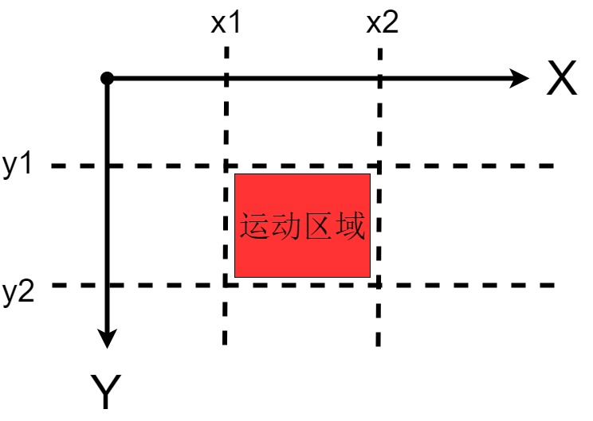


​	首先，我们需要一个行计数器（0~479），一个列计数器（0~639）来对读取到的单个像素定位。

​	这一部分代码如下：

```
reg [9:0] cnt_x;
reg [8:0] cnt_y;

always  @(posedge clk)
begin
    if(!rst)
        cnt_x<=0;
    else if(cnt_x<639 && ce_buf)
        cnt_x<=cnt_x+1;
    else if(cnt_x==639 && ce_buf)
        cnt_x<=0;
    else
        cnt_x<=cnt_x;
end

always  @(posedge clk)
begin
    if(!rst)
        cnt_y<=0;
    else if(cnt_y<479 && ce_buf && cnt_x==639)
        cnt_y<=cnt_y+1;
    else if(cnt_y==479 && ce_buf && cnt_x==639)
        cnt_y<=0;
    else
        cnt_y<=cnt_y;
end
```


​	需要注意的是，当前帧像素数据输入过程中检测包围盒时，当检测这一帧后，已经进入下一帧的处理了。那我们可以将前一帧检测的包围盒附加在后一帧上，也就是说，包围盒有一帧的延迟。


​	下面是两组包围盒坐标代码设计：

​	一组坐标保存上一帧运动区域，在每一帧结束后刷新一次。

```verilog
always @(posedge clk)
begin
    if(!rst)
        begin
            x1_cs<=0;
            x2_cs<=0;
            y1_cs<=0;
            y2_cs<=0;
        end
     else if(cnt_y==479 && ce_buf && cnt_x==639)
        begin
            x1_cs<=x1_ns;
            x2_cs<=x2_ns;
            y1_cs<=y1_ns;
            y2_cs<=y2_ns;      
        end
     else
        begin
            x1_cs<=x1_cs;
            x2_cs<=x2_cs;
            y1_cs<=y1_cs;
            y2_cs<=y2_cs;   
        end
end
```

​	另外一组坐标用于当前帧检测，处于改变过程中。x1检测横坐标最小值，x2检测横坐标最小值，y1检测纵坐标最小值，y2检测纵坐标最大值。

```verilog
always @(posedge clk)
begin
    if(!rst)
        x1_ns<=0;
    else if(cnt_y==479 && ce_buf && cnt_x==639)
        x1_ns<=639;
    else if(cnt_x<x1_ns && (abs_data>70) && ce_buf && (cnt_x>5) && (cnt_x<634))
        x1_ns<=cnt_x;
    else
        x1_ns<=x1_ns;
end         

always @(posedge clk)
begin
    if(!rst)
        x2_ns<=0;
    else if(cnt_y==479 && ce_buf && cnt_x==639)
        x2_ns<=0;
    else if(cnt_x>x2_ns && (abs_data>70) && ce_buf && (cnt_x>5) && (cnt_x<634))
        x2_ns<=cnt_x;
    else
        x2_ns<=x2_ns;
end         

always @(posedge clk)
begin
    if(!rst)
        y1_ns<=0;
    else if(cnt_y==479 && ce_buf && cnt_x==639)
        y1_ns<=469;
    else if(cnt_y<y1_ns && (abs_data>70) && ce_buf  && (cnt_y>5) && (cnt_y<474))
        y1_ns<=cnt_y;
    else
        y1_ns<=y1_ns;
end  

always @(posedge clk)
begin
    if(!rst)
        y2_ns<=0;
    else if(cnt_y==479 && ce_buf && cnt_x==639)
        y2_ns<=0;
    else if(cnt_y>y2_ns && (abs_data>70) && ce_buf && (cnt_y>5) && (cnt_y<474)  )
        y2_ns<=cnt_y;
    else
        y2_ns<=y2_ns;
end  
```


 **(9)阈值与重叠输出**

​	输入帧差数据流大于某一定值时,像素点变成红色，这将在显示器上显示出红色运动轨迹。另外，将前一帧得到的矩形包围盒变为蓝色重叠输出。这也在显示效果中得以体现。

​	下面是部分实现代码。

```verilog
always @(posedge clk)
begin
    if(!rst)
        threshold_data<=0;
    else if(ce)
        begin
            if(abs_data>70)
                threshold_data<={8'd255,8'd0,8'd0};
            else if(cnt_y==y1_cs && cnt_x<=x2_cs && cnt_x>=x1_cs)
                threshold_data<={8'd0,8'd0,8'd255};
            else if(cnt_y==y2_cs && cnt_x<=x2_cs && cnt_x>=x1_cs)
                threshold_data<={8'd0,8'd0,8'd255};          
            else if(cnt_x==x1_cs && cnt_y<y2_cs && cnt_y>y1_cs)
                threshold_data<={8'd0,8'd0,8'd255};            
            else if(cnt_x==x2_cs && cnt_y<y2_cs && cnt_y>y1_cs)
                threshold_data<={8'd0,8'd0,8'd255};              
            else 
                threshold_data<={gray_bf_2,gray_bf_2,gray_bf_2};
        end
    else
        threshold_data<=threshold_data;
end
```


#### 2.2.2 图像数据缓存和转换

​	图像数据缓存和转换，主要就是数据流格式的转换，在`AXIS<---->AXI4`和`行场视频信号<---->AXIS`之间的转换.这部分调用xilinx IP完成转换，如`DMA`、`Video In AXI4-Stream`、`AXI4-Stream to Video Out`、`Video Timing Controller`。

​	下面大致介绍下IP在缓存与转换的作用。

**（1) DMA ip核**

​	我们调用该ip核，全称是`AXI Direct Memory Access` ，接口主要由配置lite接口、读写通道以及对应中断信号组成。基本作用是负责实现AXIS和AXI4协议的转换，写通道将AXIS协议的数据流转换为AXI4后写入DDR3，而读通道读出DDR3的数据为AXI4协议的数据，经过转换为AXIS后供PL使用。

​	在这里也就是实现图像帧的搬运。


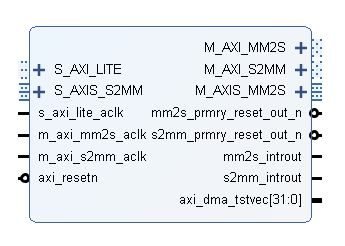


​	采样的图像数据通过 DMA 送入到 DDR，这里属于DMA的写通道的作用,每次写完一帧数据后产生对应中断，该中断函数使得下次要缓存帧的起始地址改变，再次触发写通道写入下一帧数据，而DDR缓存帧地址总共有三个起始地址，这三个缓存帧地址随着每次中断轮流交替，使得DDR中始终保存三个缓存帧，形成三缓存。

​	与此同时，被缓存的数据通过DMA从DDR中读取用于显示，这里属于DMA的读通道的作用，每次读完一帧后产生对应中断，该中断函数使得下次读取的帧始终保持在当前DMA写通道正在写入的三帧之一的前一帧，再次触发读通道读取帧用于显示。这样可以尽可能的避免出现闪烁、撕裂等不良效果。


**(2) Video In AXI4-Stream ip核**

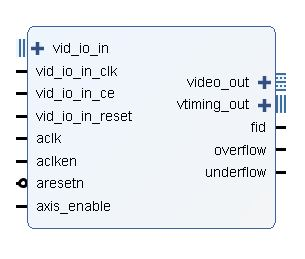

​	我们调用该IP，将行场视频信号转为 AXI4-Stream信号，提供给后续的图像处理使用。


**(3)AXI4-Stream to Video Out ip核**

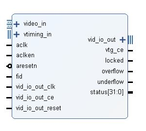

 	我们调用该IP， 将axi4-stream 的视频信号转为行场视频信号，也使用了`Video Timing Controller`实现时序同步,供之后的HDMI驱动显示器。


#### 2.2.3 图像采集和HDMI驱动

2.2.3.1 图像采集

​	这部分是将输入的cmos信号转换为`Video In AXI4-Stream`输入的行场视频信号，同时提供给` Video In AXI4-Stream`时钟同步。其中也完成RGB565到RGB888的转换。


2.2.3.2 HDMI驱动

​	这部分将输入的行场视频信号转为HDMI信号输出到开发板外接显示器。 


####  2.2.4 PS软件部分

​	该部分主要完成两个作用，一个是中断函数，这在前面介绍过DMA中断的作用，一个是I2C配置摄像头，使得摄像头输出640×480分辨率，30HZ。

​	在主函数开始的时候，完成相应的DMA和IIC初始化后，首先启动一次DMA读写通道搬运数据，之后DMA搬运数据帧将被中断持续触发，从而完成持续缓存帧以及同时显示帧的作用。


## 第三部分 完成情况及性能参数

### 3.1 完成情况

#### 3.1.1 最终完成效果


​	电路连接图：


​	效果图：


#### 3.1.2 开发过程

​	下面介绍在我们逐步开发过程中，保存的节点工程一一展示显示效果。


​	原彩色显示：


再经过灰度化+中值滤波：


随后，通过压缩然后展开重建（可以看到图像有些许的失真）：


帧差：

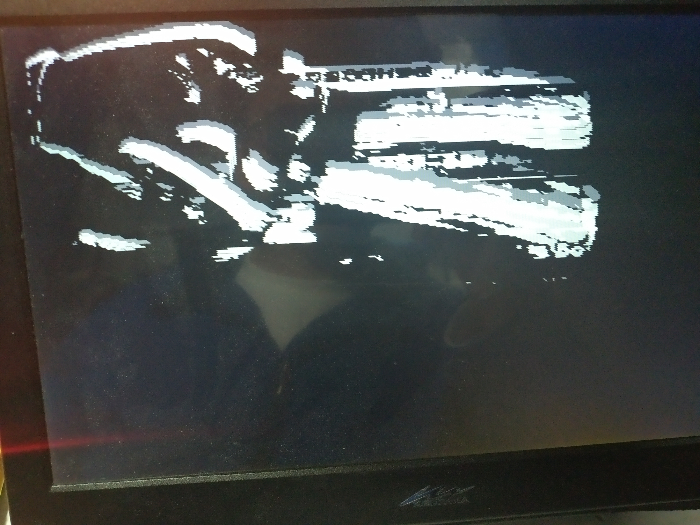


重叠输出，红色为帧差运动轨迹，蓝色为运动区域包围矩形框，而被重叠的灰度图是前面`灰度+中值滤波`的图像，下面三张图都是重叠输出的图片：


### 3.2 性能参数

#### 3.2.1 Utilization

（型号：xc7z020clg400-1）：

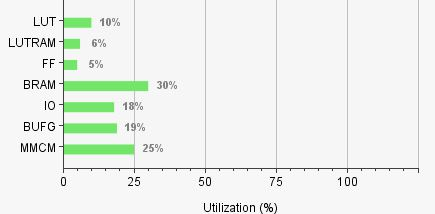

​	


#### 3.2.2 Timing Summary

（型号：xc7z020clg400-1）：

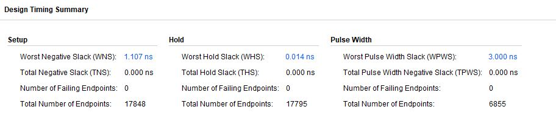


#### 3.2.3 Power

（型号：xc7z020clg400-1）：

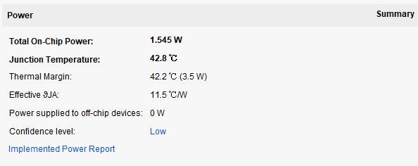

 

## 第四部分 总结 

### 4.1 主要创新点

（1）缓存背景帧时，使用2×2窗口累加压缩，再在需要读出的时候通过时序控制重建展开，大大节省缓存帧需要的BRAM。

（2）契合zynq架构，使用DMA搬运图像帧缓存在DDR3中，以及开发基于AXI4-stream的IP，具有通用性和可移植性。

（3）利用FPGA的并行流水性进行高效的图像传输和处理可以达到高实时性和稳定性。


### 4.2 可扩展之处

​	因为时间以及精力上的限制，有些地方是可以进行扩展的。

​	就比如PS端尚待开垦，在我们的设计中只是简单的裸机控制。假如它搭载linux操作系统,调用opencv库函数去对缓存在DDR3中的图像进一步处理识别。那将更有效的使用soc软硬件协同系统，也可以实现更有意思更富挑战的想法了。

​	另外，如果以后再进行类似开发，我们可能会采用VDMA的方案 ，因为VDMA相较于DMA，更适合图像帧处理，另外在配置完成后，可以无需依赖 CPU 就可以独立运行。


### 4.3 心得体会

​	经过这段时间的方案规划、代码开发和撰写文档，我们对FPGA有一个全新的认识。

​	我们深有体会，FPGA最大优势是在运算上能让批量数据并行与流水化处理，在控制上能让时序精确到每一个时钟周期。而就我们的设计而言，我们是用FPGA去做图像处理，利用并行流水化特性去进行滤波或是其他处理，从而达到高实时性的目的，而这部分如果CPU做的话就是技不如fpga了。除此之外也涉及了一些软硬件配置方面，如DMA搬运图像数据、中断触发下一次搬运、ov7725的配置等，但最主要核心的依然是设计一个通用的基于AXI-stream接口的图像处理ip核，在设计中，我们体会到AXI接口的通用性与高效性。

​	xilinx家的EDA工具vivado，经过这段时间使用，我们对vivado的使用以及开发流程也已经很熟悉了。尽管zynq作为soc不同于纯粹的FPGA，我们设计还是集中在PL部分，PS部分只是作为协同DMA搬运数据和配置摄像头罢了。经过软硬件设计与学习，我们也初步了解了zynq整个软硬件协同体系。

​	在方法的探索上，因为在赛方板子邮寄之前，我们原本使用的开发板搭载zynq-7010（xc7z010clg400-1）,和赛方提供的pynq-z2开发板相比，要少上不少BRAM资源。那zynq-7010只有堪堪60个BRAM，不足以缓存背景帧以做帧差。那我们受此限制，自然不能采用简单的直接BRAM缓存背景，而是经过一番曲折，将背景帧累加压缩再在运算时重建展开。通过这种方法，假如继续增大累加压缩的窗口，就可以进一步节省BRAM的使用了，当然会有些许运动轨迹上的失真，需要在兼顾资源和精度需求下折中考量。

​	总而言之，这次比赛提供了一次宝贵的实践机会，我们通过探索以及学习，收获颇丰。

 

## 第五部分 参考文献

**参考书籍：**

1. 《vivado从此开始》 高亚军 编著/2016-10-01/电子工业出版社

2. 《Verilog数字系统设计教程》 夏宇闻 著/2017-07-01/北京航空航天大学出版社

3. 《基于FPGA的数字信号处理》高亚军 /2015-07-01 /电子工业出版社

4. 《轻松成为设计高手--Verilog HDL实用精解》EDA先锋工作室 编著 /2012-06-01 /北京航空航天大学出版社

5. 《嵌入式系统软硬件协同设计实战指南：基于Xilinx ZYNQ》 陆佳华,江舟,马岷,孙宏滨主审 /2013-01-01 /机械工业出版社
   

**中文文献：**

1. 张鹏程. 基于FPGA运动目标检测系统的研究[D]. 中北大学, 2011

2. 朱一迪. 基于ZYNQ的实时通讯与处理系统研制[D]. 哈尔滨工业大学, 2017

3. 吴汶泰, 詹璨铭. 基于Zynq的AXI总线数据传输软件优化[J]. 通信技术, 2017, 50(7):1576-1580

4. 杜文略, 刘建梁, 沈三民,等. 基于FPGA的运动目标检测系统设计[J]. 电子技术应用, 2014, 40(11):36-38


**中文博客：**

1. 《利用ZYNQ SOC快速打开算法验证通路（3）——PS端DMA缓存数据到PS端DDR》 

链接：https://www.cnblogs.com/moluoqishi/p/9372065.html

2. 《AXI4、AXI4-Lite、AXI-Stream总线协议的简单认识》 

链接：https://blog.csdn.net/ESTA_ZhangBin/article/details/55803085

3. 《AXI4-Stream协议总结》

链接：https://blog.csdn.net/calvin790704/article/details/53942363

4. 《中值滤波原理及MATLAB实现》

链接：https://blog.csdn.net/q_z_r_s/article/details/81016820

5. 《FPGA图像处理基本技巧》

链接：https://blog.csdn.net/qq_32010099/article/details/81197260

6. 《Zedboard & Zynq 图像采集 视频开发 (二) FPGA图像采集raw转rgb888》

链接：https://blog.csdn.net/neufeifatonju/article/details/79726565


**英文文档：**

1. 《UG585 - Zynq-7000 SoC Technical Reference Manual (ver 1.12.2)》

链接：https://china.xilinx.com/support/documentation/user_guides/ug585-Zynq-7000-TRM.pdf

2. 《PG021 - AXI DMA v7.1 Product Guide (ver 7.1)》

链接：https://china.xilinx.com/support/documentation/ip_documentation/axi_dma/v7_1/pg021_axi_dma.pdf

3. 《PG044 - AXI4-Stream to Video Out v4.0 Product Guide (ver 4.0)》

链接：https://china.xilinx.com/support/documentation/ip_documentation/v_axi4s_vid_out/v4_0/pg044_v_axis_vid_out.pdf

4. 《PG043 - Video In to AXI4-Stream v4.0 Product Guide (ver 4.0)》

链接：https://china.xilinx.com/support/documentation/ip_documentation/v_vid_in_axi4s/v4_0/pg043_v_vid_in_axi4s.pdf


## 第六部分 附录

 **图像处理IP核代码完整代码：**

代码结构：

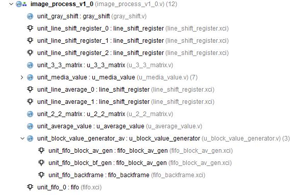

详细代码：

(1) image_process_v1_0.v

```verilog
`timescale 1 ns / 1 ps

module image_process_v1_0 #
(
	// Users to add parameters here
     
	// User parameters ends
	// Do not modify the parameters beyond this line


	// Parameters of Axi Master Bus Interface M00_AXIS
	parameter integer C_M00_AXIS_TDATA_WIDTH	= 32,
	parameter integer C_M00_AXIS_START_COUNT	= 32,

	// Parameters of Axi Slave Bus Interface S00_AXIS
	parameter integer C_S00_AXIS_TDATA_WIDTH	= 32
)
(
	// Users to add ports here
    
        
	// User ports ends
	// Do not modify the ports beyond this line


	// Ports of Axi Master Bus Interface M00_AXIS
	input wire  m00_axis_aclk,
	input wire  m00_axis_aresetn,
	output reg  m00_axis_tvalid,
	output wire [C_M00_AXIS_TDATA_WIDTH-1 : 0] m00_axis_tdata,
	output wire [(C_M00_AXIS_TDATA_WIDTH/8)-1 : 0] m00_axis_tstrb,
	output wire  m00_axis_tlast,
	input wire  m00_axis_tready,

	// Ports of Axi Slave Bus Interface S00_AXIS
	input wire  s00_axis_aclk,
	input wire  s00_axis_aresetn,
	output reg  s00_axis_tready,
	input wire [C_S00_AXIS_TDATA_WIDTH-1 : 0] s00_axis_tdata,
	input wire [(C_S00_AXIS_TDATA_WIDTH/8)-1 : 0] s00_axis_tstrb,
	input wire  s00_axis_tlast,
	input wire  s00_axis_tvalid
);

wire ce;
	
wire [7:0] gray_r;
wire [7:0] gray_data0;
wire [7:0] gray_data1;
wire [7:0] gray_data2;	

wire rnext,wnext;

wire [7:0] data11,data12,data13,data21,data22,data23,data31,data32,data33;
wire [7:0] media_value;
wire [23:0] data_out;
wire signal_empty,signal_full,signal_almost_empty,signal_almost_full;

reg [9:0] cnt;

wire [9:0] average_value;
wire [7:0] av_din0,av_din1;
wire [7:0] av_11,av_12,av_21,av_22;
wire [23:0] threshold_data;

assign rnext = s00_axis_tready && s00_axis_tvalid;
assign wnext = m00_axis_tvalid && m00_axis_tready;
assign ce = rnext;
assign m00_axis_tdata = {8'd0, data_out};

always @(posedge m00_axis_aclk)
begin
	if(!m00_axis_aresetn)
		cnt<=0;
	else if(cnt==639 && wnext)
		cnt<=0;
	else if( (cnt!=639) && wnext)
		cnt<=cnt+1;
	else 
		cnt<=cnt;
end

assign m00_axis_tlast = wnext && (cnt==639);

always @(posedge m00_axis_aclk)
begin
	if(!m00_axis_aresetn)
		m00_axis_tvalid<=1'b0;
	else if(signal_empty)
		m00_axis_tvalid<=1'b0;
	else if( signal_almost_empty && wnext )
		m00_axis_tvalid<=1'b0;
	else if( (!signal_empty) && (!m00_axis_tvalid) && m00_axis_tready )
		m00_axis_tvalid<=1'b1;
	else 
		m00_axis_tvalid<=1'b1;
end

always @(posedge m00_axis_aclk)
begin
	if(!m00_axis_aresetn)
		s00_axis_tready<=1'b0;
	else if(signal_full)
		s00_axis_tready<=1'b0;
	else if( signal_almost_full && rnext )
		s00_axis_tready<=1'b0;
	else if( (!signal_full) && (!s00_axis_tready) && s00_axis_tvalid )
		s00_axis_tready<=1'b1;
	else 
		s00_axis_tready<=1'b1;
end

gray_shift unit_gray_shift 
(
.clk(m00_axis_aclk),
.rst(m00_axis_aresetn),
.ce(ce),
.rgb(s00_axis_tdata[23:0]),
.gray(gray_r)
);

line_shift_register unit_line_shift_register_0
(
.D(gray_r),
.CLK(m00_axis_aclk),
.CE(ce),
.Q(gray_data0)
);

line_shift_register unit_line_shift_register_1
(
.D(gray_data0),
.CLK(m00_axis_aclk),
.CE(ce),
.Q(gray_data1)
);

line_shift_register unit_line_shift_register_2
(
.D(gray_data1),
.CLK(m00_axis_aclk),
.CE(ce),
.Q(gray_data2)
);

u_3_3_matrix unit_3_3_matrix
(
.clk(m00_axis_aclk),
.rst(m00_axis_aresetn),
.ce(ce),
.data_line_0(gray_data0),
.data_line_1(gray_data1),
.data_line_2(gray_data2),
.data11(data11),
.data12(data12),
.data13(data13),
.data21(data21),
.data22(data22),
.data23(data23),
.data31(data31),
.data32(data32),
.data33(data33)
);

u_media_value unit_media_value
(
.clk(m00_axis_aclk),
.rst(m00_axis_aresetn),
.ce(ce),
.data11(data11),
.data12(data12),
.data13(data13),
.data21(data21),
.data22(data22),
.data23(data23),
.data31(data31),
.data32(data32),
.data33(data33),
.final_media_data(media_value)
);
reg fifo_wr_valid,av_valid;
reg [11:0] valid_cnt;

always @(posedge m00_axis_aclk)
begin
	if(!m00_axis_aresetn)
		valid_cnt<=0;
    else if(rnext)
        valid_cnt<=valid_cnt+1;
	else 
		valid_cnt<=valid_cnt;
end

always @(posedge m00_axis_aclk)
begin
	if(!m00_axis_aresetn)
		av_valid<=1'b0;
	else if(valid_cnt==2570)
		av_valid<=1'b1;
	else 
		av_valid<=av_valid;
end

always @(posedge m00_axis_aclk)
begin
	if(!m00_axis_aresetn)
		fifo_wr_valid<=1'b0;
	else if(valid_cnt==2575)
		fifo_wr_valid<=1'b1;
	else 
		fifo_wr_valid<=fifo_wr_valid;
end

line_shift_register unit_line_average_0
(
.D(media_value),
.CLK(m00_axis_aclk),
.CE(ce),
.Q(av_din0)
);

line_shift_register unit_line_average_1
(
.D(av_din0),
.CLK(m00_axis_aclk),
.CE(ce),
.Q(av_din1)
);

u_2_2_matrix unit_2_2_matrix
(
.clk(m00_axis_aclk),
.rst(m00_axis_aresetn),
.ce(ce),
.data_line_0(av_din0),
.data_line_1(av_din1),
.data11(av_11),
.data12(av_12),
.data21(av_21),
.data22(av_22)
);

u_average_value unit_average_value
(
.clk(m00_axis_aclk),
.rst(m00_axis_aresetn),
.ce(ce),
.data11(av_11),
.data12(av_12),
.data21(av_21),
.data22(av_22),
.average_value(average_value)
);


u_block_value_generator unit_block_value_generator_av
(
.clk(m00_axis_aclk),
.rst(m00_axis_aresetn),
.ce(ce && av_valid),
.average_value(average_value),
.gray_int(av_22),
.threshold_data(threshold_data)
);

fifo unit_fifo_0
(
.clk(m00_axis_aclk),
.srst(!m00_axis_aresetn),
.din(threshold_data), 
.wr_en(ce && fifo_wr_valid),
.rd_en(wnext),
.dout(data_out),
.full(signal_full),
.almost_full(signal_almost_full),
.empty(signal_empty),
.almost_empty(signal_almost_empty),
.data_count()
);
endmodule

```

 

(2)  gray_shift.v

```verilog
module gray_shift
(
	input clk,
	input rst,
	input ce,
	input [23:0] rgb,
	output [7:0] gray
);

wire [7:0] red;
wire [7:0] green;
wire [7:0] blue;

reg [15:0] gray_r,gray_g,gray_b;
reg [7:0] gray;
wire [15:0] gray_w;

assign red = rgb[23:16];
assign green = rgb[15:8];
assign blue = rgb[7:0];

assign gray_w = gray_r + gray_g + gray_b;

always@(posedge clk)
begin
    if(!rst)
		begin
			gray_r <= 0;
			gray_g <= 0;
			gray_b <= 0;
		end
    else if(ce)
		begin
			gray_r <= (red <<6) + (red <<3) + (red <<2) + red     ;
			gray_g <= (green<<7) + (green<<4) + (green<<2) + green;
			gray_b <= (blue <<4) + (blue <<3) + (blue <<2) + 1'b1 ;
		end
	
	else
		begin
			gray_r <= gray_r;
			gray_g <= gray_g;
			gray_b <= gray_b;
		end
end

always@(posedge clk)
begin
    if(!rst)
        gray <= 0;
    else if(ce)
		gray <= gray_w[15:8];
	else
		gray <= gray;
end

endmodule
```

 

(3) 	u_3_3_matrix.v

```verilog
module u_3_3_matrix
(
	input clk,
	input rst,
	input ce,
	input [7:0] data_line_0,data_line_1,data_line_2,
	output reg [7:0] data11,data12,data13,data21,data22,data23,data31,data32,data33
);

always @(posedge clk)
begin
	if(!rst)
		begin
			data11<=0;
			data12<=0;
			data13<=0;
			data21<=0;
			data22<=0;
			data23<=0;
			data31<=0;
			data32<=0;
			data33<=0;
		end
	else if(ce)
		begin
			data11<=data_line_0;
			data12<=data_line_1;
			data13<=data_line_2;
			data21<=data11;
			data22<=data12;
			data23<=data13;
			data31<=data21;
			data32<=data22;
			data33<=data23;		
		end
	else
		begin
			data11<=data11;
			data12<=data12;
			data13<=data13;
			data21<=data21;
			data22<=data22;
			data23<=data23;
			data31<=data31;
			data32<=data32;
			data33<=data33;		
		end
end


endmodule
```


(4)	u_media_value.v

```verilog
module u_media_value
(
	input clk,
	input rst,
	input ce,
	input [7:0] data11,data12,data13,data21,data22,data23,data31,data32,data33,
	output [7:0] final_media_data
);

wire [7:0] max_data1, mid_data1, min_data1; 
wire [7:0] max_data2, mid_data2, min_data2;
wire [7:0] max_data3, mid_data3, min_data3;
wire [7:0] max_min_data, mid_mid_data, min_max_data; 

u_sort unit0 
(  
.clk  (clk),  
.rst  (rst), 
.ce   (ce),   
.data1  (data11),   
.data2  (data12),   
.data3  (data13),    
.max_data (max_data1),  
.mid_data (mid_data1),  
.min_data (min_data1) 
); 

u_sort unit1
(  
.clk  (clk),  
.rst  (rst),  
.ce   (ce),   
.data1  (data21),   
.data2  (data22),   
.data3  (data23),    
.max_data (max_data2),  
.mid_data (mid_data2),  
.min_data (min_data2) 
); 

u_sort unit2
(  
.clk  (clk),  
.rst  (rst),  
.ce   (ce),   
.data1  (data31),   
.data2  (data32),   
.data3  (data33),    
.max_data (max_data3),  
.mid_data (mid_data3),  
.min_data (min_data3) 
); 

u_sort unit3
(  
.clk  (clk),  
.rst  (rst), 
.ce   (ce),    
.data1  (max_data1),   
.data2  (max_data2),   
.data3  (max_data3),    
.max_data (),  
.mid_data (),  
.min_data (max_min_data) 
); 
 
u_sort unit4
(  
.clk  (clk),  
.rst  (rst), 
.ce   (ce),    
.data1  (mid_data1),   
.data2  (mid_data2),   
.data3  (mid_data3),    
.max_data (),  
.mid_data (mid_mid_data),  
.min_data () 
); 
 
u_sort unit5
(  
.clk  (clk), 
.rst  (rst), 
.ce   (ce),    
.data1  (min_data1),   
.data2  (min_data2),   
.data3  (min_data3),    
.max_data (min_max_data),  
.mid_data (),  
.min_data ()
);

u_sort unit6
(  
.clk  (clk),  
.rst  (rst),  
.ce   (ce),   
.data1  (max_min_data),   
.data2  (mid_mid_data),   
.data3  (min_max_data),    
.max_data (),  
.mid_data (final_media_data),  
.min_data   () 
);

endmodule
```


(5)	u_sort.v

```verilog
module u_sort
(  
input	clk,
input	rst,
input	ce,    
input  [7:0] data1, data2, data3,  
output reg [7:0] max_data, mid_data, min_data 
); 

always@(posedge clk) 
begin  
	if(!rst)   
		begin   
			max_data <= 0;   
			mid_data <= 0;   
			min_data <= 0;   
		end  
	else if(ce)
		begin
			if(data1 >= data2 && data1 >= data3)    
				max_data <= data1;   
			else if(data2 >= data1 && data2 >= data3)    
				max_data <= data2;   
			else   
				max_data <= data3; 
 
			if((data1 >= data2 && data1 <= data3) || (data1 >= data3 && data1 <= data2))    
				mid_data <= data1;   
			else if((data2 >= data1 && data2 <= data3) || (data2 >= data3 && data2 <= data1))   
				mid_data <= data2;   
			else   
				mid_data <= data3;   
				
			if(data1 <= data2 && data1 <= data3)    
				min_data <= data1;   
			else if(data2 <= data1 && data2 <= data3)    
				min_data <= data2;   
			else    
				min_data <= data3;  
		end
	else	
		begin      
			max_data <= max_data;   
			mid_data <= mid_data;   
			min_data <= min_data;   		
		end 
end 

endmodule
```


(6)	u_2_2_matrix.v

```verilog
module u_2_2_matrix
(
	input clk,
	input rst,
	input ce,
	input [7:0] data_line_0,data_line_1,
	output reg [7:0] data11,data12,data21,data22
);

always @(posedge clk)
begin
	if(!rst)
		begin
			data11<=0;
			data12<=0;
			data21<=0;
			data22<=0;
		end
	else if(ce)
		begin
			data11<=data_line_0;
			data12<=data_line_1;
			data21<=data11;
			data22<=data12;
		end
	else
		begin
			data11<=data11;
			data12<=data12;
			data21<=data21;
			data22<=data22;
		end
end


endmodule
```


(7)	u_average_value.v

```verilog
module u_average_value
(
	input clk,
	input rst,
	input ce,
	input [7:0] data11,data12,data21,data22,
	output reg [9:0] average_value
);

reg [8:0] av_buffer1,av_buffer2;

always @(posedge clk)
begin
	if(!rst)
		begin
		av_buffer1<=0;
		av_buffer2<=0;
		average_value<=0;
		end
	else if(ce)
		begin
		av_buffer1<=data11+data12;
		av_buffer2<=data21+data22;
		average_value<=av_buffer1+av_buffer2;
		end
	else
		begin
		av_buffer1<=av_buffer1;
		av_buffer2<=av_buffer2;
		average_value<=average_value;
		end
end 


endmodule
```


(8)	u_block_value_generator.v

```verilog
module u_block_value_generator
(
	input clk,
	input rst,
	input ce,
	input [9:0] average_value,
	input [7:0] gray_int,
	output reg [23:0] threshold_data
);

reg [9:0] x1_ns,x2_ns;
reg [8:0] y1_ns,y2_ns;
reg [9:0] x1_cs,x2_cs;
reg [8:0] y1_cs,y2_cs;

reg [9:0] cnt_x;
reg [8:0] cnt_y;

reg [10:0] cnt;
reg [16:0] bf_cnt;

reg [9:0] value_generated,bf_generated;

reg wr;
wire rd;
wire [9:0] fifo_gen,fifo_gen_bf;

reg backframe_rd_valid;
wire [9:0] back_pixel;
reg [9:0] sub_data1,sub_data2;
reg [9:0] abs_data;

reg [7:0] gray_bf_0,gray_bf_1,gray_bf_2;

assign rd = (cnt>=640) && ce;

always @(posedge clk)
begin
    if(!rst)
        wr<=0;
    else 
        wr<=(cnt<640) && ce;
end

always @(posedge clk)
begin
	if(!rst)
		cnt<=0;
	else if( ce && (cnt==1279) )
		cnt<=0;
	else if( ce && (cnt!=1279) )
		cnt<=cnt+1;
	else
	   cnt<=cnt;
end

always @(posedge clk)
begin
	if(!rst)
		bf_cnt<=0;
	else if( (cnt[0]==0) && (cnt<640) && ce && (bf_cnt==76799) )
		bf_cnt<=76800;
	else if( (cnt[0]==0) && (cnt<640) && ce && (bf_cnt<76799) )
		bf_cnt<=bf_cnt+1;
	else
	    bf_cnt<=bf_cnt;
end

always @(posedge clk)
begin
    if(!rst)
        backframe_rd_valid<=0;
    else if( ce && (bf_cnt==76799) )
        backframe_rd_valid<=1;
    else
        backframe_rd_valid<=backframe_rd_valid;
end

fifo_block_av_gen unit_fifo_block_av_gen
(
.clk(clk),
.srst(!rst),
.din(value_generated),
.wr_en(wr),
.rd_en(rd),
.dout(fifo_gen),
.data_count()
);

fifo_block_av_gen unit_fifo_block_bf_gen
(
.clk(clk),
.srst(!rst),
.din(bf_generated),
.wr_en(wr),
.rd_en(rd),
.dout(fifo_gen_bf),
.data_count()
);

fifo_backframe unit_fifo_backframe
(
.clk(clk),
.srst(!rst),
.din(average_value), 
.wr_en( (cnt[0]==0) && (cnt<640) && ce),
.rd_en( (cnt[0]==0) && (cnt<640) && ce && backframe_rd_valid),
.dout(back_pixel),
.data_count()
);

always @(posedge clk)
begin
	if(!rst)
		value_generated<=0;
	else if( (cnt[0]==0) && (cnt<640) && ce ) 
		value_generated<=average_value;
	else if( (cnt[0]==1) && (cnt<640) && ce )
		value_generated<=value_generated;
	else if( (cnt>=640) && ce )
		value_generated<=fifo_gen;	
	else
		value_generated<=value_generated;
end

always @(posedge clk)
begin
    if(!rst)
        gray_bf_0<=0;
    else if(ce)
        gray_bf_0<=gray_int;
    else
        gray_bf_0<=gray_bf_0;
end

always @(posedge clk)
begin
	if(!rst)
		bf_generated<=0;
	else if( (cnt[0]==0) && (cnt<640) && ce ) 
		bf_generated<=back_pixel;
	else if( (cnt[0]==1) && (cnt<640) && ce )
		bf_generated<=bf_generated;
	else if( (cnt>=640) && ce )
		bf_generated<=fifo_gen_bf;	
	else
		bf_generated<=bf_generated;
end

always @(posedge clk)
begin
    if(!rst)
        begin
            sub_data1<=0;
            sub_data2<=0;
        end
    else if(ce)
        begin
            sub_data1<=value_generated;
            sub_data2<=bf_generated;
        end
    else
        begin
            sub_data1<=sub_data1;
            sub_data2<=sub_data2;
        end
end

always @(posedge clk)
begin
    if(!rst)
        gray_bf_1<=0;
    else if(ce)
        gray_bf_1<=gray_bf_0;
    else
        gray_bf_1<=gray_bf_1;
end

always @(posedge clk)
begin
    if(!rst)
        abs_data<=0;
    else if(ce)
        begin
            if(sub_data1>sub_data2)
                abs_data<=sub_data1-sub_data2;
            else
                abs_data<=sub_data2-sub_data1;
        end
    else
        abs_data<=abs_data;
end

always @(posedge clk)
begin
    if(!rst)
        gray_bf_2<=0;
    else if(ce)
        gray_bf_2<=gray_bf_1;
    else
        gray_bf_2<=gray_bf_2;
end

reg [7:0] gray_buffer;
wire gray_1bit_end;

assign gray_1bit_end = (sub_data1[2] || sub_data1[1]);

always @(posedge clk)
begin
    if(!rst)
        gray_buffer<=0;
    else if(ce)
        gray_buffer<={sub_data1[9:3],gray_1bit_end};
    else
        gray_buffer<=gray_buffer;
end


reg ce_buf;
reg ce_0,ce_1;

always @(posedge clk)
begin
    if(!rst)
        begin
        ce_0<=0;
        ce_1<=0;
        ce_buf<=0;
        end
    else
        begin
        ce_0<=ce;
        ce_1<=ce_0;
        ce_buf<=ce_1;
        end
end

always  @(posedge clk)
begin
    if(!rst)
        cnt_x<=0;
    else if(cnt_x<639 && ce_buf)
        cnt_x<=cnt_x+1;
    else if(cnt_x==639 && ce_buf)
        cnt_x<=0;
    else
        cnt_x<=cnt_x;
end

always  @(posedge clk)
begin
    if(!rst)
        cnt_y<=0;
    else if(cnt_y<479 && ce_buf && cnt_x==639)
        cnt_y<=cnt_y+1;
    else if(cnt_y==479 && ce_buf && cnt_x==639)
        cnt_y<=0;
    else
        cnt_y<=cnt_y;
end

always @(posedge clk)
begin
    if(!rst)
        begin
            x1_cs<=0;
            x2_cs<=0;
            y1_cs<=0;
            y2_cs<=0;
        end
     else if(cnt_y==479 && ce_buf && cnt_x==639)
        begin
            x1_cs<=x1_ns;
            x2_cs<=x2_ns;
            y1_cs<=y1_ns;
            y2_cs<=y2_ns;      
        end
     else
        begin
            x1_cs<=x1_cs;
            x2_cs<=x2_cs;
            y1_cs<=y1_cs;
            y2_cs<=y2_cs;   
        end
end

always @(posedge clk)
begin
    if(!rst)
        x1_ns<=0;
    else if(cnt_y==479 && ce_buf && cnt_x==639)
        x1_ns<=639;
    else if(cnt_x<x1_ns && (abs_data>70) && ce_buf && (cnt_x>5) && (cnt_x<634))
        x1_ns<=cnt_x;
    else
        x1_ns<=x1_ns;
end         

always @(posedge clk)
begin
    if(!rst)
        x2_ns<=0;
    else if(cnt_y==479 && ce_buf && cnt_x==639)
        x2_ns<=0;
    else if(cnt_x>x2_ns && (abs_data>70) && ce_buf && (cnt_x>5) && (cnt_x<634))
        x2_ns<=cnt_x;
    else
        x2_ns<=x2_ns;
end         

always @(posedge clk)
begin
    if(!rst)
        y1_ns<=0;
    else if(cnt_y==479 && ce_buf && cnt_x==639)
        y1_ns<=469;
    else if(cnt_y<y1_ns && (abs_data>70) && ce_buf  && (cnt_y>5) && (cnt_y<474))
        y1_ns<=cnt_y;
    else
        y1_ns<=y1_ns;
end  

always @(posedge clk)
begin
    if(!rst)
        y2_ns<=0;
    else if(cnt_y==479 && ce_buf && cnt_x==639)
        y2_ns<=0;
    else if(cnt_y>y2_ns && (abs_data>70) && ce_buf && (cnt_y>5) && (cnt_y<474)  )
        y2_ns<=cnt_y;
    else
        y2_ns<=y2_ns;
end  

always @(posedge clk)
begin
    if(!rst)
        threshold_data<=0;
    else if(ce)
        begin
            if( (cnt_x<10) ||(cnt_x>629) || (cnt_y<10) || (cnt_y>469) )
                threshold_data<=24'd0;
            if(abs_data>70)
                threshold_data<={8'd255,8'd0,8'd0};
            else if(cnt_y==y1_cs && cnt_x<=x2_cs && cnt_x>=x1_cs)
                threshold_data<={8'd0,8'd0,8'd255};
            else if(cnt_y==y2_cs && cnt_x<=x2_cs && cnt_x>=x1_cs)
                threshold_data<={8'd0,8'd0,8'd255};          
            else if(cnt_x==x1_cs && cnt_y<y2_cs && cnt_y>y1_cs)
                threshold_data<={8'd0,8'd0,8'd255};            
            else if(cnt_x==x2_cs && cnt_y<y2_cs && cnt_y>y1_cs)
                threshold_data<={8'd0,8'd0,8'd255};              
            else 
                threshold_data<={gray_bf_2,gray_bf_2,gray_bf_2};
        end
    else
        threshold_data<=threshold_data;
end

endmodule
```

